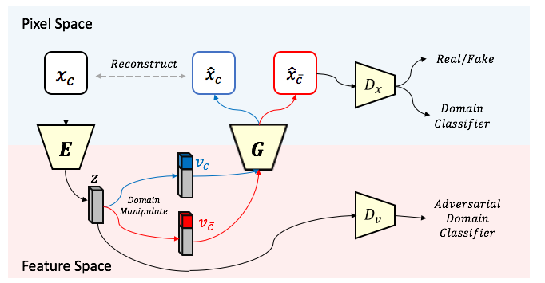
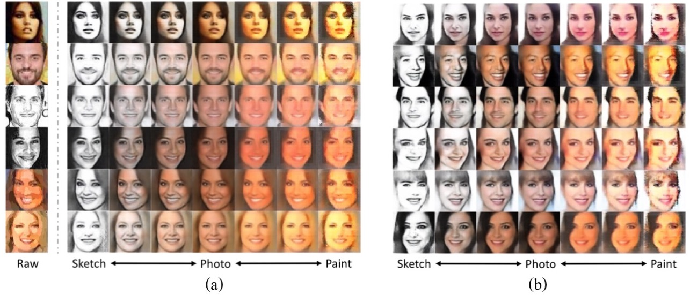
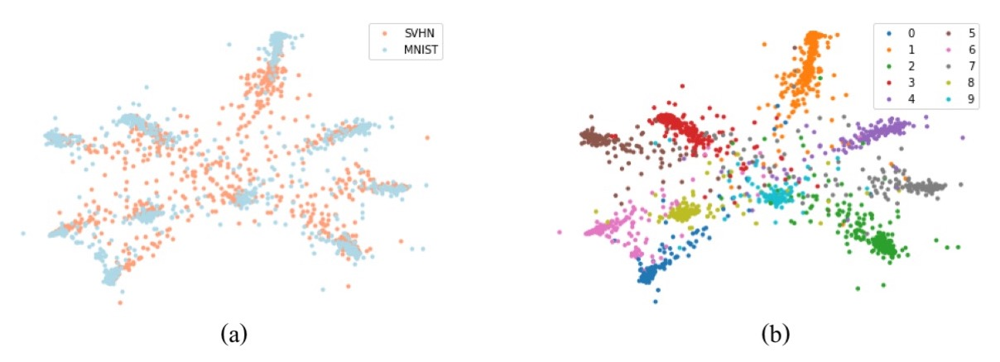

# UFDN - Pytorch Implementation


## Description


This is a PyTorch implementation of my paper [A Unified Feature Disentangler for Multi-Domain Image Translation and Manipulation](https://arxiv.org/abs/1809.01361) (UFDN)  accepted by NIPS 2018.
Please feel free to use/modify them, any bug report or improvement suggestion will be appreciated.

## Model


 
 For more detailed information, please refer to the paper.
 
## Application

-   Image-to-Image translation / Cross-domain image generation

    With domain invariant representation, domain vector and unified decoder, UFDN is able to perform (a) continuious image translation across different domains and/or attributes at interest (b) image generation across different domains.


-   Unsupervised domain adaption (UDA)

    UDA can be addressed via the domain invariant representation learned by UFDN. As reported in the paper, UFDN's UDA performance on digit dataset is the current state-of-the-art. The figure visualizes the domain invariant representation learned by our UFDN, colored w.r.t. (a) dataset (b) digit.



## Requirements

##### Execution Environment

- Python 3
- CUDA & GPU availible device

##### Packages

- [PyTorch](http://pytorch.org/) (0.4.0 or later version)
- torchvision
- [scikit-image](https://scikit-image.org/)
- [matplotlib](https://matplotlib.org/)
- [h5py](https://www.h5py.org/)
- [tensorboardX](https://github.com/lanpa/tensorboard-pytorch)
- urllib
- wget
- gzip


## Setup

#### Download pretrained model & dataset

Dataset is availible [here](https://drive.google.com/file/d/1_XmbzBLC1dELhDTEMZShiMohVJaHaWaN/view?usp=sharing). To run the code, please download and place it under ```data/```.
Pretrained model is also availible [here](https://drive.google.com/open?id=1MoMWN8oFZVsSbRjRDlw-dMyHfHR9JjHC), you can download it if you'd like to try.

#### Train your own model

To train UFDN, make sure all requirements are satisfied and run

```python3 train_face.py <path/to/config>```

See [example config](config/face_hd.yaml) for more options avialible. Please refer to the paper's supplementary for config used in the main paper.

#### Training log & inference

To see learning curve and some translation/generation result, use tensorboard to access training log (location specified in config). E.g. ```tensorboard --logdir=log/```

## Notes
- face_hd is the config for demo (image-to-image translation) only.
- Please refer to the paper for more experiment config/settings, including image generation & UDA.

## Reference
Please cite the article:

"A Unified Feature Disentangler for Multi-Domain Image Translation and Manipulation"
Alexander Liu, Yen-Chen Liu, Yu-Ying Yeh, Yu-Chiang Frank Wang, NIPS'18

Please also cite the article if you find the face dataset helpful:

"Detach and Adapt: Learning Cross-Domain Disentangled Deep Representation" Yen-Cheng Liu, Yu-Ying Yeh, Tzu-Chien Fu, Sheng-De Wang, Wei-Chen Chiu, Yu-Chiang Frank Wang, CVPR'18 (spotlight)

