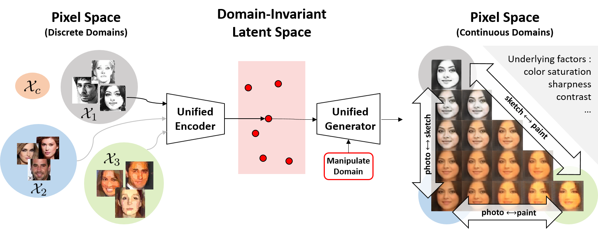

# UFDN - Pytorch Implementation


## Description



This is a PyTorch implementation of my paper [A Unified Feature Disentangler for Multi-Domain Image Translation and Manipulation](https://arxiv.org/abs/1809.01361) (UFDN)  accepted by NIPS 2018.
Please feel free to use/modify them, any bug report or improvement suggestion will be appreciated.

## Model


 
 For more detailed information, please refer to the paper.
 
## Application

-   Image-to-Image translation / Cross-domain image generation

    With domain invariant representation, domain vector and unified decoder, UFDN is able to perform (a) continuous image translation across different domains and/or attributes at interest (b) image generation across different domains. Pre-trained model & dataset are available, see next section.
    

-   Unsupervised domain adaption (UDA)

    UDA can be addressed via the domain invariant representation learned by UFDN. As reported in the paper, UFDN's UDA performance on digit dataset is the current state-of-the-art. The figure visualizes the domain invariant representation learned by our UFDN, colored w.r.t. (a) dataset (b) digit. 

    
    
    Model trained on MNIST and tested on SVHN is available [here](https://drive.google.com/drive/folders/1k7rEHOS-EypCAFEIBygo-_YRaupYj4nh?usp=sharing), it's logger is also available [here](https://drive.google.com/file/d/1EULdjHuE-Ac_8r55qG-37VK5nnwyXoee/view?usp=sharing). This model was trained with the [example config](config/uda_example.yaml) identical to the paper, recording accuracy __0.9579__ on SVHN testing setting.


## Requirements

##### Execution Environment

- Python 3
- CUDA & GPU available device

##### Packages

- [PyTorch](http://pytorch.org/) (0.4.0 or later version)
- torchvision
- [scikit-image](https://scikit-image.org/)
- [matplotlib](https://matplotlib.org/)
- [h5py](https://www.h5py.org/)
- [tensorboardX](https://github.com/lanpa/tensorboard-pytorch)
- urllib
- wget
- gzip


## Setup

#### Download pretrained model & dataset

~~Dataset is available here. To run the code, please download and place it under ```data/```.~~
Human face dataset is currently unavailible due to  [CelebA](http://mmlab.ie.cuhk.edu.hk/projects/CelebA.html)'s prohibition of futher publication, we will make it availible if we get the premission in the future.
Pretrained model is also available [here](https://drive.google.com/file/d/1MoMWN8oFZVsSbRjRDlw-dMyHfHR9JjHC/view?usp=sharing), you can download it if you'd like to try.

#### Train your own model

To train UFDN, make sure all requirements are satisfied and run

```python3 train_face.py <path/to/config>```

See [example config](config/face_hd.yaml) for more options avialible. Please refer to the paper's supplementary for config used in the main paper.

#### Training log & inference

To see learning curve and some translation/generation result, use tensorboard to access training log (location specified in config). E.g. ```tensorboard --logdir=log/```

## Notes
- face_hd is the config for demo (image-to-image translation) only.
- For UDA reproducibility, please refer to the [supplemental](https://papers.nips.cc/paper/7525-a-unified-feature-disentangler-for-multi-domain-image-translation-and-manipulation) of main paper and also [issue #6](https://github.com/Alexander-H-Liu/UFDN/issues/6) for more experiment config/settings.

## Reference
Please cite the article:

"A Unified Feature Disentangler for Multi-Domain Image Translation and Manipulation"
Alexander H. Liu, Yen-Cheng Liu, Yu-Ying Yeh, Yu-Chiang Frank Wang, NIPS'18

Please also cite the article if you find the face dataset helpful:

"Detach and Adapt: Learning Cross-Domain Disentangled Deep Representation" Yen-Cheng Liu, Yu-Ying Yeh, Tzu-Chien Fu, Sheng-De Wang, Wei-Chen Chiu, Yu-Chiang Frank Wang, CVPR'18 (spotlight)

